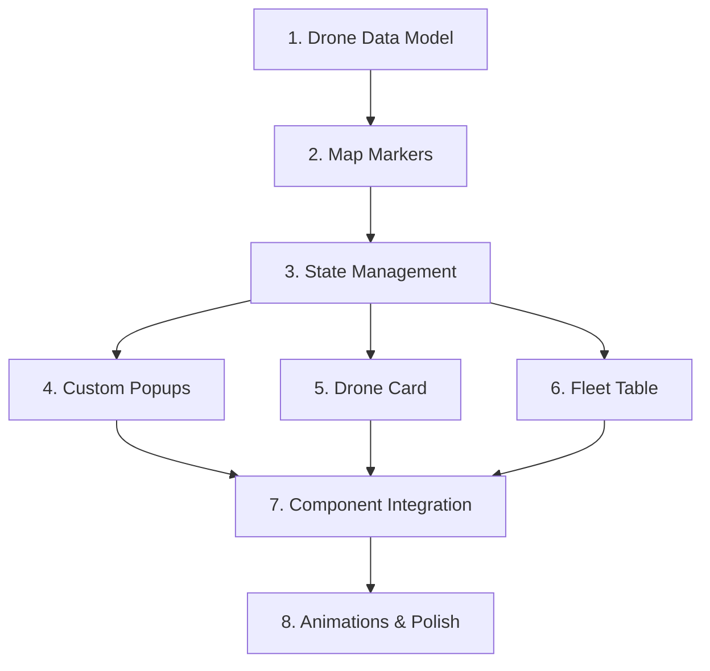

# Drone Fleet Map Development Roadmap

This roadmap outlines the feature-by-feature development plan for the interactive drone fleet management application using Mapbox GL JS and React.

## Development Order & Architecture

The features are ordered to build foundational elements first, then layer on interactivity and polish:



---

## Feature 1: Drone Data Model & Mock Dataset

**Priority:** Foundation (Must build first)

**Approach:**

- Create a `src/data/drones.js` file to store the mock drone dataset
- Generate 20 drone objects with all required fields
- Structure the data with proper TypeScript-style JSDoc comments for IDE support

**Implementation Details:**

- Each drone object should have: `id`, `status` ('delivering' | 'standby'), `battery` (0-100), `name` ('Skyrunner X1' | 'Skyrunner X2'), `eta` (only if active), `range` (calculated from battery), `load` (1-4), and `coordinates` (lat/lng for London area based on the reference image)
- Use realistic London coordinates spread across central London (longitude: -0.15 to 0.1, latitude: 51.48 to 51.55)
- Calculate `range` as: battery < 25% ? 5-10km : battery < 50% ? 10-20km : 20-40km
- Only include `eta` field when status is 'delivering'
- Export as a constant array for easy import

**Technical Considerations:**

- Keep this as a static file for now (no API calls)
- Ensure diverse status distribution: ~11 standby (green), ~6 delivering (blue), ~4 low battery (orange override)
- Use realistic battery percentages distributed across the range

---

## Feature 2: Dynamic Map Markers with Color Coding

**Priority:** Core Feature (Build second)

**Approach:**

- Import drone data into `App.jsx`
- Use react-map-gl's `<Marker>` component to render each drone
- Implement color logic based on status and battery level
- Create custom SVG or HTML marker elements for better styling

**Implementation Details:**

- Create a `getMarkerColor()` utility function:
  - Battery < 25% → Orange (#FF9500)
  - Status 'delivering' → Blue (#007AFF)
  - Status 'standby' → Green (#34C759)
- Map over the drones array and render a `<Marker>` for each
- Position markers using drone coordinates
- Use HTML markers (not symbols) for easier styling: `<div>` with circular shape

**Code Structure:**

```javascript
// In App.jsx
import { Marker } from 'react-map-gl/mapbox';
import { drones } from './data/drones';

// Marker rendering
{drones.map(drone => (
  <Marker
    key={drone.id}
    longitude={drone.coordinates.lng}
    latitude={drone.coordinates.lat}
  >
    <div className="marker" style={{backgroundColor: getMarkerColor(drone)}} />
  </Marker>
))}
```

**Styling:**

- Create `.marker` class with circular shape (border-radius: 50%)
- Size: ~24px diameter
- Add subtle box-shadow for depth
- cursor: pointer for interactivity

---

## Feature 3: Selected Drone State Management

**Priority:** Core Infrastructure (Build third)

**Approach:**

- Implement React state to track which drone is currently selected
- Create event handlers for marker clicks
- Ensure only one drone can be selected at a time

**Implementation Details:**

- Add `const [selectedDrone, setSelectedDrone] = useState(null)` in App.jsx
- Create `handleDroneSelect(droneId)` function that sets the selected drone
- Add conditional styling to markers to show selected state
- Selected marker should be visually distinct (larger, different border, etc.)

**State Shape:**

```javascript
selectedDrone: string | null  // stores the drone id or null
```

**Deselection Logic:**

- Clicking a new drone replaces the current selection
- Closing the card (later feature) sets state to null
- No "click map to deselect" behavior - only explicit actions deselect

**Technical Considerations:**

- This state will be consumed by: markers, popup, card, and table components
- Consider lifting state up if components become nested
- For now, keep everything in App.jsx to avoid prop drilling

---

## Feature 4: Custom Popup Component on Hover

**Priority:** Interaction Feature (Build fourth)

**Approach:**

- Create a custom popup component that appears on marker hover
- Override all Mapbox default popup styles
- Use react-map-gl's `<Popup>` component with custom content
- Implement hover state management separate from selection

**Implementation Details:**

- Add `const [hoveredDrone, setHoveredDrone] = useState(null)` state
- Add `onMouseEnter` and `onMouseLeave` handlers to markers
- Render `<Popup>` conditionally when `hoveredDrone` is not null
- Position popup at the hovered drone's coordinates

**Popup Content:**

- Display: drone name, status, battery percentage, range
- If delivering, show ETA
- Compact design with icon indicators

**CSS Reset for Mapbox Popups:**

```css
/* Remove all default Mapbox popup styles */
.mapboxgl-popup-content {
  background: transparent !important;
  padding: 0 !important;
  box-shadow: none !important;
}

.mapboxgl-popup-tip {
  display: none !important;
}
```

**Custom Popup Styling:**

- Dark background with slight transparency (rgba(0, 0, 0, 0.85))
- Rounded corners (8px)
- Modern font with proper hierarchy
- Color-coded status indicator
- Min-width: 200px

**Technical Considerations:**

- Hover should work independently of selection
- Popup should close when mouse leaves marker (500ms delay to prevent flicker)
- Use `closeButton={false}` and `closeOnClick={false}` props

---

## Feature 5: Drone Info Card Component

**Priority:** UI Feature (Build fifth)

**Approach:**

- Create a `DroneCard.jsx` component in `src/components/`
- Position fixed in bottom-right corner
- Animate in/out based on `selectedDrone` state
- Include close button that deselects the drone

**Implementation Details:**

- Component receives: `drone` object and `onClose` callback
- Display comprehensive drone information:
  - Drone model name and 3D icon/image
  - Battery level with visual progress bar
  - Range in kilometers
  - Load capacity
  - Status badge
  - If delivering, show ETA with countdown styling

**Component Structure:**

```jsx
// DroneCard.jsx
export default function DroneCard({ drone, onClose }) {
  if (!drone) return null;
  
  return (
    <div className="drone-card">
      <button className="close-btn" onClick={onClose}>×</button>
      {/* Card content */}
    </div>
  );
}
```

**Styling:**

- Position: fixed, bottom: 24px, right: 24px
- Width: 320px
- Dark theme to match map
- Glass-morphism effect (backdrop-blur)
- Slide-in animation from right (transform: translateX)
- Z-index above map but below popups

**Animation:**

- Use CSS transitions for smooth entrance/exit
- Consider adding `opacity` and `transform` transitions
- Duration: 300ms with ease-in-out

**Technical Considerations:**

- Handle null drone gracefully (don't render)
- Close button calls `onClose` which sets `selectedDrone` to null in parent
- Make responsive for smaller screens (reduce width at mobile breakpoint)

---

## Feature 6: Fleet Overview Table Component

**Priority:** UI Feature (Build sixth)

**Approach:**

- Create `FleetTable.jsx` component in `src/components/`
- Position fixed in top-left corner
- Implement expandable/collapsible behavior
- Show first 3 drones initially, expand to show all 20

**Implementation Details:**

- Component manages its own expanded state: `const [isExpanded, setIsExpanded] = useState(false)`
- Receives: `drones` array, `selectedDrone` id, `onDroneSelect` callback, `onDroneHover` callback
- Table columns: Status Icon, Model, Battery, ETA, Range
- Sort drones: Active first, then low battery, then standby

**Component Structure:**

```jsx
// FleetTable.jsx
export default function FleetTable({ 
  drones, 
  selectedDrone, 
  onDroneSelect, 
  onDroneHover 
}) {
  const [isExpanded, setIsExpanded] = useState(false);
  const visibleDrones = isExpanded ? drones : drones.slice(0, 3);
  
  return (
    <div className="fleet-table">
      <div className="table-header">
        <h2>FLEET OVERVIEW</h2>
        <div className="status-counts">
          {/* Show counts for active, ready, low battery */}
        </div>
      </div>
      <table>
        {/* Table rows */}
      </table>
      <button onClick={() => setIsExpanded(!isExpanded)}>
        {isExpanded ? 'COLLAPSE' : 'VIEW ALL'}
      </button>
    </div>
  );
}
```

**Table Styling:**

- Position: fixed, top: 24px, left: 24px
- Max-width: 400px
- Dark background with glass-morphism
- Status icons as colored circles (same colors as markers)
- Battery shown as percentage with mini progress bar
- Highlight selected drone row with subtle border/background
- Smooth height transition when expanding/collapsing

**Status Overview Section:**

- Show counts: Active (blue icon + count), Ready (green icon + count), Low Battery (orange icon + count)
- Position above table, horizontally aligned

**Interaction Behavior:**

- Row hover: calls `onDroneHover(drone.id)` to show popup on map
- Row click: calls `onDroneSelect(drone.id)` to select drone
- Mouse leave: calls `onDroneHover(null)` to hide popup

**Technical Considerations:**

- Use proper table semantics (`<table>`, `<thead>`, `<tbody>`)
- Highlight selected row with conditional className
- N/A for ETA when drone is in standby
- Animate height change using `max-height` transition or `grid-template-rows`

---

## Feature 7: Component Integration & Synchronization

**Priority:** Integration (Build seventh)

**Approach:**

- Connect all components to work together seamlessly
- Ensure table hover shows map popup
- Ensure table click selects drone (triggers card + map focus)
- Synchronize state across all components

**Implementation Details:**

- Table hover (`onMouseEnter` on row) → updates `hoveredDrone` state → popup appears on map
- Table click → updates `selectedDrone` state → card appears + marker highlights
- Map marker hover → popup appears
- Map marker click → updates `selectedDrone` → card appears
- Card close → clears `selectedDrone` → card disappears + marker dehighlights

**State Flow:**

```javascript
// In App.jsx
const [selectedDrone, setSelectedDrone] = useState(null);
const [hoveredDrone, setHoveredDrone] = useState(null);

// Pass to FleetTable
<FleetTable
  drones={drones}
  selectedDrone={selectedDrone}
  onDroneSelect={setSelectedDrone}
  onDroneHover={setHoveredDrone}
/>

// Pass to DroneCard
<DroneCard
  drone={drones.find(d => d.id === selectedDrone)}
  onClose={() => setSelectedDrone(null)}
/>
```

**Technical Considerations:**

- Ensure popup can be triggered from both map hover and table hover
- When table row is hovered, popup should appear at the corresponding marker
- Prevent conflicts between hover and selection states
- Test all interaction paths: map→card, table→card, card close

---

## Feature 8: Animations & Polish

**Priority:** Enhancement (Build last)

**Approach:**

- Implement Mapbox flyTo animation when drone is selected
- Add pulse animation to selected marker
- Polish transitions and micro-interactions

**Implementation Details:**

### Fly-to Animation:

- Use `mapRef` with `useRef()` hook to access map instance
- When `selectedDrone` changes, call `mapRef.current.flyTo()`
- Fly to selected drone's coordinates with zoom level 14
- Duration: 1000ms with smooth easing

```javascript
// In App.jsx
const mapRef = useRef();

useEffect(() => {
  if (selectedDrone && mapRef.current) {
    const drone = drones.find(d => d.id === selectedDrone);
    mapRef.current.flyTo({
      center: [drone.coordinates.lng, drone.coordinates.lat],
      zoom: 14,
      duration: 1000,
      essential: true
    });
  }
}, [selectedDrone]);
```

### Pulse Animation:

- Add CSS animation to selected marker
- Create `@keyframes pulse` animation that scales and adjusts opacity
- Apply to marker when `drone.id === selectedDrone`

```css
@keyframes pulse {
  0%, 100% { 
    transform: scale(1); 
    box-shadow: 0 0 0 0 rgba(255, 255, 255, 0.7); 
  }
  50% { 
    transform: scale(1.1); 
    box-shadow: 0 0 0 10px rgba(255, 255, 255, 0); 
  }
}

.marker.selected {
  animation: pulse 2s infinite;
}
```

### Additional Polish:

- Smooth marker scale on hover (transform: scale(1.15))
- Stagger table row animations when expanding
- Loading states if needed for future API integration
- Add subtle shadows and highlights for depth
- Ensure all transitions are smooth (300ms standard)

**Technical Considerations:**

- Test flyTo with map boundaries (don't fly too far out)
- Ensure animations don't impact performance (use `transform` and `opacity` only)
- Consider reduced motion preferences (`@media (prefers-reduced-motion)`)
- Make sure pulse animation doesn't interfere with hover states

---

## Testing Checklist

After completing all features, verify:

- [ ] All 20 drones render with correct colors
- [ ] Marker colors update based on battery/status
- [ ] Hover on marker shows popup
- [ ] Click marker selects drone and opens card
- [ ] Hover on table row shows map popup
- [ ] Click table row selects drone
- [ ] Selected drone shows pulse animation
- [ ] Map flies to selected drone
- [ ] Only one drone can be selected at a time
- [ ] Card close button deselects drone
- [ ] Selecting new drone deselects previous
- [ ] Table expands/collapses smoothly
- [ ] Status counts are accurate
- [ ] All responsive breakpoints work

---
